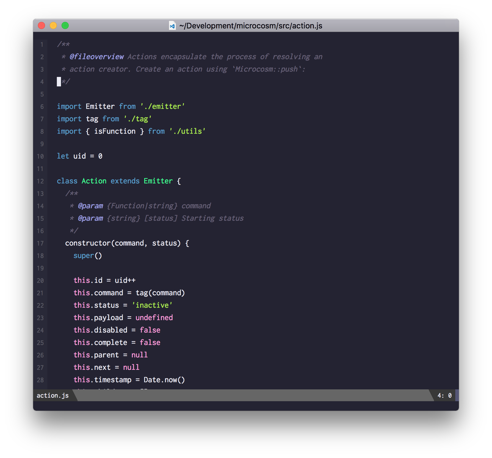

# JSDoc Minor Mode

I wanted basic syntax highlighting for JSDoc in [web-mode](http://web-mode.org). So here we
are.

## Fair warning

I'm not too familiar with writing minor modes, so this is probably a
total hack. But an effective one for my purposes.

## Install

Pull down `jsdoc-minor-mode.el`. Then add this to your init file:

```emacs-lisp
(require 'jsdoc-minor-mode)

(defun is-javascript-file ()
  "Is the current buffer a JavaScript file?"
  (string= (file-name-extension buffer-file-name) "js"))

(defun add-jsdoc-if-javascript ()
  "JavaScript startup behavior."
  (when (is-javascript-file)
    (jsdoc-minor-mode))

(add-hook 'web-mode 'add-jsdoc-if-javascript)
```


